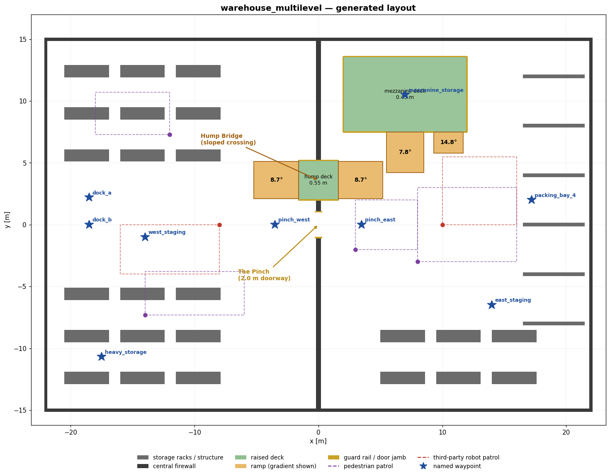

# Adaptive Navigation and Conflict-Aware Path Planning

A ROS 2 navigation stack for a heterogeneous AMR fleet in a multi-level
logistics warehouse: cooperative SLAM with selective map iteration, a
slope-aware global planner, conflict-aware local planning with a priority-based
yielding protocol, a low-latency safety override, and a BSP-style sensor
validation layer.

**Target platform:** ROS 2 Humble · Gazebo Classic 11 · Ubuntu 22.04

---

## Table of contents

- [Quick start](#quick-start)
- [What to look at first](#what-to-look-at-first)
- [Architecture](#architecture)
- [The command chain](#the-command-chain)
- [Running the demonstrations](#running-the-demonstrations)
- [The warehouse](#the-warehouse)
- [Scaling the fleet](#scaling-the-fleet)
- [Packages](#packages)
- [Testing](#testing)
- [Configuration reference](#configuration-reference)
- [Troubleshooting](#troubleshooting)
- [Further reading](#further-reading)

---

## Quick start

### 1. Dependencies

```bash
sudo apt update
sudo apt install -y \
  ros-humble-desktop \
  ros-humble-gazebo-ros-pkgs ros-humble-gazebo-plugins \
  ros-humble-navigation2 ros-humble-nav2-bringup ros-humble-nav2-smac-planner \
  ros-humble-slam-toolbox \
  ros-humble-xacro ros-humble-robot-state-publisher \
  ros-humble-tf2-ros ros-humble-tf2-geometry-msgs \
  python3-colcon-common-extensions python3-rosdep
```

### 2. Build

```bash
cd rse_ws
source /opt/ros/humble/setup.bash
rosdep install --from-paths src --ignore-src -r -y
colcon build --symlink-install
source install/setup.bash
```

A clean build produces no warnings. Every package compiles with
`-Wall -Wextra -Wpedantic -Wshadow`; `amr_core` adds `-Wconversion`.

### 3. Run

```bash
ros2 launch amr_bringup fleet.launch.py
```

Gazebo, RViz, two robots, SLAM, nav2, the traffic controller and map fusion all
come up. Robots are staggered by six seconds — see
[Troubleshooting](#troubleshooting) if your machine needs longer.

### 4. Give it something to do

In a second terminal:

```bash
source install/setup.bash

# The brief's primary scenario: concurrent goals for both robots.
ros2 run amr_bringup send_goals.py \
    --goal amr1=heavy_storage \
    --goal amr2=packing_bay_4

# What else is reachable by name:
ros2 run amr_bringup send_goals.py --list
```

---

## What to look at first

If you have ten minutes and want to judge the engineering rather than the
feature list, these are the files worth opening:

| File | Why |
|---|---|
| [`amr_fleet_control/src/motion_smoother.cpp`](src/amr_fleet_control/src/motion_smoother.cpp) | The terminal-approach law, and the comment explaining why the obvious continuous-time formula silently violates the jerk limit it is supposed to enforce. |
| [`amr_fleet_control/include/.../safety_monitor.hpp`](src/amr_fleet_control/include/amr_fleet_control/safety_monitor.hpp) | Why the halt latches, and why the component fails closed while the traffic controller next to it fails open. |
| [`amr_gazebo/amr_gazebo/world_builder.py`](src/amr_gazebo/amr_gazebo/world_builder.py) | The world, its elevation map and its waypoints are three renderings of one description, so they cannot disagree. |
| [`amr_sensor_bsp/include/.../sensor_validators.hpp`](src/amr_sensor_bsp/include/amr_sensor_bsp/sensor_validators.hpp) | The hard/soft fault distinction, and the IMU-informed ground-return rejection that is what actually makes the ramps navigable. |
| [`docs/REFACTORING.md`](docs/REFACTORING.md) | The refactoring deliverable: before, after, and what it bought. |
| [`docs/REQUIREMENTS.md`](docs/REQUIREMENTS.md) | Every requirement in the brief, mapped to the file that implements it and the test that proves it. |

---

## Architecture

```
                        ┌──────────────────────────────┐
                        │        amr_core              │
                        │  RobotProfile, FleetConfig    │
                        │  (no rclcpp — pure C++)      │
                        └──────────────┬───────────────┘
                                       │ every package reads its
                                       │ limits from here
        ┌──────────────┬───────────────┼──────────────┬────────────────┐
        │              │               │              │                │
┌───────▼──────┐ ┌─────▼──────┐ ┌──────▼──────┐ ┌─────▼──────┐ ┌───────▼──────┐
│amr_sensor_bsp│ │amr_mapping │ │amr_fleet_   │ │amr_        │ │amr_gazebo /  │
│              │ │            │ │control      │ │navigation  │ │amr_          │
│ validate     │ │ selective  │ │ smoother    │ │ slope layer│ │description   │
│ LiDAR/IMU/cam│ │ mapping    │ │ safety      │ │ fleet layer│ │ world, URDF  │
│              │ │ map fusion │ │ traffic     │ │ (costmap   │ │              │
│              │ │            │ │ trajectory  │ │  plugins)  │ │              │
└──────────────┘ └────────────┘ └─────────────┘ └────────────┘ └──────────────┘
```

Two structural decisions run through the whole codebase:

**Algorithms are ROS-free.** `MotionSmoother`, `SafetyMonitor`,
`ConflictDetector`, `YieldPolicy`, `SelectiveMappingPolicy`, `MapFusion`,
`SlopeCostModel` and the three sensor validators are plain C++ classes with no
`rclcpp` dependency. The nodes are thin adapters. That is why 268 automated tests can
exercise the control laws directly — including timings and failure modes that
are impractical to stage in a simulator — instead of inferring behaviour by
watching a robot.

**Configuration has one home.** Physical limits live in
`amr_description/config/robot_models.yaml` and nowhere else. The xacro reads it,
`amr_core::ModelLibrary` parses it into typed structs, and the launch files
derive nav2's parameters from it. Changing `max_accel_x` for the heavy mapper
retunes its planner, its smoother and its Gazebo plugin together. See
[`docs/REFACTORING.md`](docs/REFACTORING.md).

---

## The command chain

This is the single most important diagram in the repository. It is what makes
the safety override an override rather than a suggestion:

```
   nav2 controller_server
          │  /<robot>/cmd_vel_nav
          ▼
   ┌──────────────────────────────────────────────────┐
   │ velocity_smoother                                │
   │  • applies the traffic directive's speed scale   │
   │  • enforces acceleration and jerk limits for     │
   │    this model, payload and current speed         │
   └──────────────────────────────────────────────────┘
          │  /<robot>/cmd_vel_smoothed
          ▼
   ┌──────────────────────────────────────────────────┐
   │ safety_override            ← SOLE cmd_vel writer │
   │  • d_safe = k·v² + d_min                         │
   │  • discards the command outright on violation    │
   │  • fails closed on sensor loss                   │
   └──────────────────────────────────────────────────┘
          │  /<robot>/cmd_vel
          ▼
      Gazebo diff-drive → wheels
```

Three consequences worth stating explicitly:

- **A yield is a controlled stop.** The traffic controller scales the *target*
  velocity, so the jerk limiter still shapes the deceleration. It never writes a
  zero to the base.
- **A safety halt is not.** It bypasses the smoother entirely, because "stop
  now" is exactly the case where a smooth ramp-down is wrong.
- **Nothing else may publish `cmd_vel`.** There is no path from a planner to the
  wheels that skips the override.

The two arbitration layers also fail in deliberately opposite directions. The
traffic controller **fails open**: if it dies, robots stop being told to yield
and throughput degrades, but they keep moving. The safety override **fails
closed**: no scan, a stale scan, or a scan the BSP layer rejected all halt the
robot. A throughput optimiser that immobilises the fleet on failure is a bad
optimiser; a collision guard that assumes the world is clear when it cannot see
is a dangerous guard.

---

## Running the demonstrations

Each script tests one requirement and exits non-zero on failure, so they double
as acceptance checks. Run them with the fleet already up.

### Concurrent goals

```bash
ros2 run amr_bringup send_goals.py --goal amr1=heavy_storage --goal amr2=packing_bay_4
```

Both goals are dispatched and awaited together.

### Safety override

```bash
ros2 run amr_bringup demo_safety_override.py --robot amr1 --speed 0.5
```

Publishes a constant forward velocity straight into `cmd_vel_nav`, ignoring
every obstacle, and records what actually reaches `cmd_vel`. Watching a robot
stop in Gazebo does not distinguish an override from nav2 simply planning
around something; this does. Reports the obstacle distance, the envelope at that
speed, and the measured reaction latency from the sensor's own timestamp.

### Conflict and yielding

```bash
ros2 run amr_bringup demo_conflict.py
```

Sends both robots through The Pinch — a 2.0 m doorway, wide enough for one — from
opposite sides simultaneously. Prints a timeline of directives, how long the
loser was held, and the minimum separation actually achieved. Fails if the wrong
robot yielded, if neither did, or if they came closer than their combined
footprints.

### Slope-aware planning (A/B/C)

```bash
ros2 run amr_bringup demo_slope_planning.py
```

Asks the planner for the same path three times:

| | Configuration | Expected route |
|---|---|---|
| **A** | slope cost ON, doorway open | the flat doorway |
| **B** | slope cost ON, doorway blocked | the sloped bridge — now the only crossing |
| **C** | slope cost OFF, doorway open | the control |

A and B together are the requirement: ramps avoided when an alternative exists,
used when one does not. **C is what makes A meaningful** — without it, "the
planner avoided the ramp" could just mean the flat route was shorter anyway.

### Payload-dependent motion

```bash
# Watch the acceleration profile change with load.
ros2 topic echo /amr1/cmd_vel --field linear.x &
ros2 service call /amr1/set_payload amr_msgs/srv/SetPayload "{payload_kg: 0.0}"
ros2 service call /amr1/set_payload amr_msgs/srv/SetPayload "{payload_kg: 110.0}"
```

At full load AMR-1's effective acceleration limit drops from 0.35 to
0.16 m/s², and the ramp to speed visibly lengthens.

### Selective mapping

```bash
ros2 topic echo /amr1/map_update_stats
```

`suppression_ratio` climbs as the robot re-covers ground it already knows, while
`frontier_cells` keeps flowing. `policy_state` reports `frontier_burst`,
`exploring` or `throttled`.

### Sensor validation

```bash
ros2 topic echo /amr1/sensor_health
```

Per-stream received/rejected/degraded counts and measured rate. To see the IMU
plausibility warning the brief asks for, spin a robot hard in Gazebo or
temporarily lower `imu.max_angular_velocity` in `robot_models.yaml`.

---

## The warehouse



44 m × 30 m, generated rather than hand-authored:

```bash
ros2 run amr_gazebo generate_world.py
```

One geometric description emits the `.world`, the elevation map the slope
planner reads, and the named waypoints. They cannot disagree, because they are
three renderings of the same data — and the test suite asserts the ramp slabs'
SDF poses match the elevation model to within a millimetre.

Features, and what each exists to exercise:

| Feature | Purpose |
|---|---|
| **Central firewall** at x = 0 | Splits the floor with exactly two crossings, so route choice is observable rather than incidental. |
| **The Pinch** (2.0 m doorway) | The flat crossing. One robot fits, two do not → the yielding protocol has to fire. |
| **Hump Bridge** (0.55 m, 8.7° ramps, 3.0 m wide) | The sloped crossing. Wider and more comfortable than The Pinch in every respect except gradient — so a planner that ignores slope will happily use it. |
| **Mezzanine deck** (0.45 m, 7.8° and 14.8° ramps) | Reachable *only* by ramp. Forces the "only viable path" case, and makes the planner price two gradients against each other. |
| **Rack blocks**, 2.4 m aisles | Real aisle-routing problems for the global planner. |
| **6 dynamic obstacles** | Four pedestrians and two third-party robots, on seeded patrol loops. Real models with collision geometry, so the LiDAR genuinely sees them. |

> Gazebo Classic `<actor>` elements carry no collision geometry and are
> invisible to a LiDAR. Using them would have made every "the robot avoided the
> pedestrian" claim a fiction.

Named waypoints: `dock_a`, `dock_b`, `heavy_storage`, `packing_bay_4`,
`mezzanine_storage`, `east_staging`, `west_staging`, `pinch_west`, `pinch_east`.

---

## Scaling the fleet

The brief asks that the fleet be expandable to ten or more robots by changing a
minimal number of configuration parameters. It is one file:

```bash
ros2 launch amr_bringup fleet.launch.py \
    fleet_config:=$(ros2 pkg prefix amr_bringup)/share/amr_bringup/config/fleet_ten_robots.yaml
```

`fleet_ten_robots.yaml` is the two-robot roster with eight more entries. No new
message, no new node, no launch-file edit, no new robot model — the ten robots
come out of the same two models.

This works because nothing names a robot:

- `fleet.launch.py` iterates the roster;
- every node takes `robot_name` and reads its profile from `amr_core::FleetConfig`;
- `ConflictDetector` and `YieldPolicy` are written over the roster, not over a pair;
- `map_fusion` creates one subscription per entry and anchors each robot's SLAM frame from its start pose;
- the RViz config is generated by iterating the roster.

Two invariants are enforced at load time, in both the C++ and the Python
loaders, so a bad roster fails immediately rather than misbehaving later:

1. **Unique names** — the name is used verbatim as a ROS namespace, so a
   duplicate would silently cross-wire two robots' `cmd_vel`.
2. **Unique priorities** — equal priorities make the yield decision depend on
   message arrival order, which is how an intermittent deadlock gets shipped.

Ten full nav2 stacks plus Gazebo is heavy on one machine; the claim is that the
software scales, not that a laptop does. The ten-robot roster is exercised in
unit tests (`FleetConfigTest.ScalesToTenRobotsWithNoCodeChange`,
`YieldPolicyTest.WorksUnchangedForATenRobotFleet`), which is the cheap way to
check it.

---

## Packages

| Package | Contents |
|---|---|
| `amr_core` | `RobotProfile`, `DynamicLimits`, `SafetySpec`, `FleetConfig`, geometry helpers. No `rclcpp`. |
| `amr_msgs` | `PredictedTrajectory`, `TrafficDirective`, `SafetyStatus`, `SensorHealth`, `MapUpdateStats`, `PayloadState`, two services. |
| `amr_description` | Parametric xacro; one macro renders both models from `robot_models.yaml`. |
| `amr_gazebo` | Programmatic world generation, elevation map, dynamic-obstacle driver. |
| `amr_sensor_bsp` | LiDAR / IMU / camera validators and the gate node. |
| `amr_fleet_control` | Motion smoother, safety override, trajectory prediction, traffic controller. |
| `amr_mapping` | Selective-iteration mapping policy, log-odds map fusion. |
| `amr_navigation` | `SlopeLayer` and `FleetTrajectoryLayer` nav2 costmap plugins. |
| `amr_bringup` | Launch tree, fleet roster, nav2 parameters, demo scripts. |

---

## Testing

```bash
colcon test --event-handlers console_direct+
colcon test-result --verbose
```

**268 tests**, all passing:

| Suite | Tests | What it covers |
|---|---:|---|
| `amr_core` | 27 | Dynamic envelope arithmetic, safety envelope, config loading and every rejection path. |
| `amr_fleet_control` | 66 | Smoother bounds and convergence, safety latching and fail-safe posture, conflict detection, yielding, starvation, trajectory prediction. |
| `amr_sensor_bsp` | 31 | Every validator, hard vs soft grading, ground-return rejection. |
| `amr_mapping` | 24 | Selective mapping suppression and its safety properties, log-odds fusion. |
| `amr_navigation` | 19 | Slope cost curve and the real generated elevation map. |
| `amr_gazebo` | 16 | World geometry, reachability, ramp/elevation agreement. |
| `amr_bringup` | 40 | Roster loading, scaling, nav2 parameter derivation. |

Tests assert properties the requirements depend on, not just that code runs. A
few that are load-bearing:

- `MotionSmootherTest.NeverExceedsTheJerkLimit` — caught a real defect where
  velocity-ceiling saturation injected unbounded jerk. See
  [`docs/DESIGN_NOTES.md`](docs/DESIGN_NOTES.md).
- `SafetyMonitorTest.DoesNotChatterAtTheBoundary` — drives the monitor at
  exactly the trigger distance for 200 cycles and requires at most one
  transition.
- `ConflictDetectorTest.CrossingPathsAtDifferentTimesAreNotAConflict` — the
  property that separates a space-time detector from a path-intersection test.
- `test_world_generation.py::test_mezzanine_is_reachable_only_by_ramp` — seals
  both ramp mouths and requires the deck to become unreachable, so the "only
  viable path" scenario provably tests something.
- `SlopeCostModelTest.TheGradientDoesNotDependOnWhereInACellYouAsk` — regression
  guard for a floating-point aliasing bug that halved measured gradients.

Consistency check, runnable without building:

```bash
ros2 run amr_bringup check_model_consistency.py
```

Verifies every roster resolves, priorities are unique, each model's safety
envelope is within its own LiDAR range, each IMU plausibility limit exceeds the
commandable yaw rate, and every model can climb the steepest ramp in the world.

### Style

Google C++ Style for C++, PEP 8 for Python, both enforced in `colcon test` via
`ament_uncrustify`, `ament_cpplint` and `ament_flake8`.

---

## Configuration reference

Three files, with distinct jobs:

**`amr_description/config/robot_models.yaml`** — what a *model* of robot is.
Geometry, mass, dynamic envelope, safety constants, sensor specs. Read by the
xacro, the C++ stack and the launch files.

**`amr_bringup/config/fleet.yaml`** — which robots *exist*. Name, model, start
pose, priority, plus the fleet-wide traffic policy.

**`amr_bringup/config/nav2_params.yaml`** — one template for every robot. Each
per-robot value is rewritten at launch from the model library.

Frequently-touched knobs:

| Parameter | File | Effect |
|---|---|---|
| `max_accel_x`, `max_jerk_x` | `robot_models.yaml` | Ramp aggressiveness. Retunes planner, smoother and plugin together. |
| `payload_derating` | `robot_models.yaml` | How much a full load costs in acceleration. |
| `safety_k`, `safety_d_min` | `robot_models.yaml` | The `d_safe = k·v² + d_min` envelope. |
| `imu.max_angular_velocity` | `robot_models.yaml` | IMU plausibility limit. Lower it to see the warning fire. |
| `hard_yield_seconds` | `fleet.yaml` | Time-to-conflict at which a slow-down becomes a stop. |
| `max_yield_seconds` | `fleet.yaml` | How long before a starved robot is boosted. |
| `saturation_visits` | `slam.launch.py` | Traversals before an area is throttled. |
| `max_traversable_angle_degrees` | `nav2_params.yaml` | Slope at which terrain becomes lethal. |

---

## Troubleshooting

**nav2 lifecycle bonds time out on startup.** Two nav2 stacks plus Gazebo is a
lot for one machine. Raise the stagger:

```bash
ros2 launch amr_bringup fleet.launch.py spawn_delay:=10.0
```

**Robots do not move.** The safety override fails closed, so it halts when it
cannot see. Check in order:

```bash
ros2 topic echo /amr1/safety_status --once     # halt_active and reason
ros2 topic echo /amr1/sensor_health            # is the BSP layer rejecting scans?
ros2 topic hz /amr1/scan                       # is validated data flowing at all?
```

`reason: 3` is `SENSOR_TIMEOUT` — nothing is reaching `scan`.

**No merged map in RViz.** Fusion needs contributions. Check
`/amr1/map_contribution` is publishing, and that the static transforms
`map → amr1/map` exist (`ros2 run tf2_tools view_frames`).

**The planner refuses the mezzanine.** Its ramps are 7.8° and 14.8°. If
`max_traversable_angle_degrees` is set below 15, the steep ramp is correctly
lethal — that is the per-model limit doing its job. Check the loaded value:

```bash
ros2 param get /amr1/global_costmap/global_costmap slope_layer.max_traversable_angle_degrees
```

**Phantom obstacles on the ramps.** The IMU-informed ground-return rejection
should suppress them. Confirm the IMU is validated and flowing — the LiDAR
validator only trusts attitude from an accepted IMU sample:

```bash
ros2 topic echo /amr1/sensor_health | grep -A2 imu
```

**Gazebo runs slowly.** Drop the GUI (`gui:=false`), or the dynamic obstacles
(`dynamic_obstacles:=false`) to separate a planner problem from a traffic one.

---

## Further reading

- [`docs/RUNBOOK.md`](docs/RUNBOOK.md) — step-by-step run order, and what every file does.
- [`docs/ARCHITECTURE.md`](docs/ARCHITECTURE.md) — node graph, topics, frames.
- [`docs/REFACTORING.md`](docs/REFACTORING.md) — the refactoring deliverable.
- [`docs/REQUIREMENTS.md`](docs/REQUIREMENTS.md) — requirement → implementation → test.
- [`docs/DESIGN_NOTES.md`](docs/DESIGN_NOTES.md) — the decisions worth arguing about, and the bugs found along the way.
- [`docs/VIDEO_WALKTHROUGH.md`](docs/VIDEO_WALKTHROUGH.md) — script for the screenshare submission.

---

## Licence

Apache-2.0.
